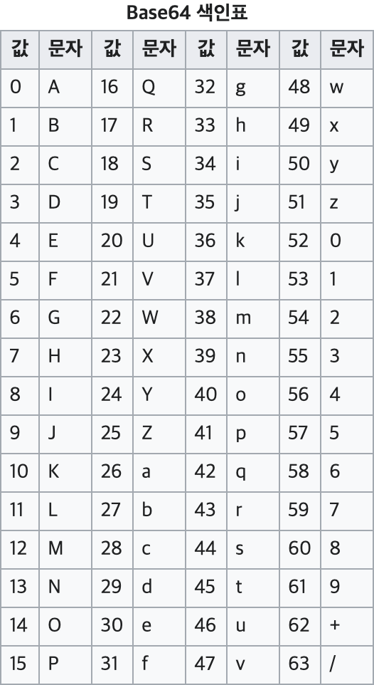

# Base64란?

Base64란 8비트 2진 데이터(zip파일이나 exe파일 등)을 문자 코드에 영향을 받지 않는 공통 ASCII 영역의 문자들로만 이루어린 일련의 문자열로 바꾸는 **인코딩** 방식이다.  
base64를 그대로 풀이하면 64진법이란 뜻이다. 64는 2의 제곱수(64 = 2^6)이고, 2의 제곱수에 기반한 진법들 중에서 화면에 표시되는 ASCII 문자들을 써서 표현할 수 있는 가장 큰 진법이기 때문이다.

이 인코딩은 전자 메일을 통한 이진 데이터 전송 등에 많이 쓰인다. Base64는 어떤 문자와 기호를 쓰냐에 따라 많은 종류가 있지만, 가장 기본적인 것은 A-Z,a-z,0-9를 사용해서 62개이고 나머지 2개를 어떤 기호를 쓰냐에 차이가 있다. = 는 패딩(끝을 알리는 코드) 문자이다.

일반적으로 컴퓨터 데이터나 ASCII 문자들은 8비트(1바이트) 씩 묶어있다. 그러나 base64는 인코딩을 위해서 문자열 2진 데이터를 6비트씩 묶는다. 대신에 혼란이 오지 않도록 8비트와 6비트의 최소 공배수인 24비트씩 끊어서 인코딩한다.

## Base64인코딩이 초기 문자보다 데이터 크기가 커지는데 사용하는 이유는 무엇일까?

Base64 인코딩을 하게 되면 전송하는 데이터도 커지고 인코딩과 디코딩 하기 위해 추가적인 연산도 필요한데 왜 사용할까?  
문자를 전송하기 위해서는 설계된 미디어(email, html)을 통해 독립적으로 바이너리 데이터를 전송할 필요가 있을 때, ASCII로 인코딩하여 전송하게 되면 문제가 발생할 수 있다.

- ASCII code는 7bit 인코딩이지만 나머지 1bit 처리하는 방식이 시스템 별로 다르다.
- 일부 제어문자의 경우에 시스템 별로 다른 코드 값을 갖는다.

이러한 문제로 인해 ASCII는 시스템간 데이터를 전달하기에 **안전하지가 않다.** Base64는 ASCII의 제어문자와 일부 특수문자를 제외한 64개의 **안전한 출력 문자** 만 사용한다.

> 여기서 안전하다는 뜻은 문자 코드에 영향을 받지 않는 공통 ASCII를 말한다.

정리하면, Base64는 HTML, Email과 같이 문자를 위한 미디어에 바이너리 데이터를 포함해야 할 필요가 있을 때, 포함된 바이너리 데이터가 시스템 독립적으로 전송 또는 저장되는 것을 보장하기 위해 사용한다.

## Base64 테이블

## 인코딩 방법

| 문자열 |    S     |    U     |    N     |
| :----: | :------: | :------: | :------: |
| ASCII  |    83    |    85    |    78    |
| binary | 01010011 | 01010101 | 01001110 |

이것을 6비트로 묶어 보면

| binary  | 010100 | 110101 | 010101 | 001110 |
| :-----: | :----: | :----: | :----: | :----: |
| decimal |   20   |   53   |   21   |   14   |
| base64  |   U    |   1    |   V    |   O    |

최종적으로 SUN을 base64로 인코딩한 값은 U1VO가 되는 것이다.

이 과정을 순서로 풀어보면

1. 문자열
2. ASCII code
3. binary
4. 6비트로 cut
5. base64 encode

가된다.

그렇지만 한가지 문제가 있다.
문자열들이 3개씩 완전히 나누어지지 않는다면 어떻게 할까?
이 대안으로 **패딩 =** 이라는 것이 존재한다.

문자열이 **SUN NY**라면 NY쪽에 1자리가 비어버린다.
6비트씩 똑같이 쪼갠 후에 남은 비트가 있으면 뒤에 0을 붙여서 6비트로 만들어 준 후 인코딩한다.
그 다음에 인코딩된 결과뒤에 빈 자리 수만큼(SUNNY의 경우 1개) 뒤에 패딩을 붙여준다.
결과적으로 SUNNY의 base64 값은 **U1VOTlk=**이 된다.

[온라인 Base64 인코딩 디코딩 해주는 사이트 바로가기](https://www.base64decode.org/)

### References

https://ko.wikipedia.org/wiki/%EB%B2%A0%EC%9D%B4%EC%8A%A464  
https://beankhan.tistory.com/28
https://effectivesquid.tistory.com/entry/Base64-%EC%9D%B8%EC%BD%94%EB%94%A9%EC%9D%B4%EB%9E%80
