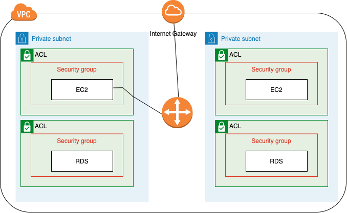

# VPC(Virtual Private Cloud)

## 정의를 찾아보면

- 클라우드 환경 상에서 **논리적으로** 격리된 유저 전용 네트워크 공간이다. (NAVER의 NPC)
- 가상의 사설 네트워크를 제공한다. (NHN의 toast)
- 샤용자의 AWS 계정 전용 가상 네트워크 (Amazon의 AWS)
- 가상 머신 인스턴스, 컨테이너등에 네트워킹 기능을 제공한다.(Google의 GCP)
  -> 유저에게 제공하는 인스턴스, 컨테이너간 (논리적으로 격리된) 가상의 private 네트워크을 제공하는 클라우드 서비스이다.
  

### private 네트워크란?

- 인터넷상에서 사설 IP 주소를 사용하는 네트워크
- 가정, 사무실, 기업에서 쓰임
-

### 그렇다면 가상의 private 네트워크(=VPN)는 무엇인가?

- 회사나 몇몇 단체가 내용을 바깥 사람에게 드러내지 않고 통신할 목적으로 쓰이는 네트워크이다.
- 물리적 네트워크 사이의 공용 네트워크를 통해 생성된 가상 네트워크
- 각각 흩어져있는 컴퓨터들이 내부 네트워크에 있는 것 처럼 사용할 수 있는 것!
- 통신할 때 암호화하여 통신하기 때문에 인터넷을 제공하는 서비스 업체나 해커, 국가들이 데이터를 볼 수 없음!
  

따라서, VPC는 물리적으로 흩어져있는 인스턴스들을 유저에게 가상의 사설 네트워크를 제공하는 서비스이다. 또한, 통신할 떄 암호화하여 보안이 강하다.

_암호화한다면 속도에 문제가 생기지 않을까?_
AWS의 VPC상의 전송 중 암호화할 때 성능에 영향을 미치지 않는다.
https://docs.aws.amazon.com/ko_kr/vpc/latest/userguide/data-protection.html

## VPC의 구성 요소들

### VPC

프라이빗한 클라우드를 만드는데 기본이 되는 리소스이다. vpc 이름과 IPv4 CIDR 블록을 필수적으로 가진다.

CIDR 블록은 IP의 범위를 지정하는 방식이다. IP 주소와 슬래시 뒤에 따라오는 넷마스크 숫자로 구성되어 있다. 172.31.0.0/16 면 IP범위는 지정된 IP부터 2^(32-16)개가 된다. 따라서, 172.31.0.0에서 172.255.255까지 65,536개의 주소를 사용할 수 있다!

AWS에서 하나의 VPC 자원의 최대 크기는 16(CIDR이 16)

**고려해야 할 문제**
만약 실제 사용되는 구글 IP를 vpc의 IPv4 CIDR로 사용한다면 VPC상에서 구글 IP로 접속하는 트래픽은 VPC 내부로 라우트 되기 떄문에 구글에 접속이 불가능하다. 따라서 사설망 전용 IP 대역을 사용해야한다!

### 서브넷

VPC는 다시 한 번 CIDR 블록을 가지는 단위로 나눠진다(VPC안에 VPC가 있다는 느낌). 서브넷은 실제 인스턴스와 연결된다.

### 라우팅 테이블과 라우터

네트워크 요청이 발생하면 데이터는 우선 라우터로 향하게 되는데 라우팅 테이블에 해당 요청의 목적지가 있다. 하나의 테이블 떠는 각각의 서브넷이 라우팅테이블을 가지고 있을 수 있다.
VPC안에 잇는 네트워크 범위를 갖는 요청은 로컬(VPC 내부)에서 찾도록 되어있다. 그 이외의 VPC 외부의 네트워크 범위를 갖는 요청은 인터넷 게이트 웨이를 통해 처리된다.

### 인터넷 게이트웨이

VPC는 격리된 네트워크이기 때문에 인터넷 게이트웨이를 통해 인터넷과 연결할 수 있다. 하지만 서비넷과 인터넷 게이트워이를 연결하는 것만으로는 인터넷을 사용할 수 없다. 인터넷을 사용하고자 하는 리소스에 퍼블릭 IP를 가지고 있어야한다.

### 네트워크 ACL / 시큐리티 그룹

네트워크 ACL은 인바운드 아웃바운드 트래픽을 제어하는 가상 방화벽이다! 시큐리티 그룹은 인스턴스 앞단에서 트래픽을 제어하는 가상의 방화벽인 반면에 네트워크 ACL은 서브넷 앞단에서 트래픽을 제어한다. 따라서 네트워크 ACL의 규칙을 통과하더라도 시큐리티 그룹의 규칙을 통과하지 못하면 통신하지 못한다.

## 총 구조

