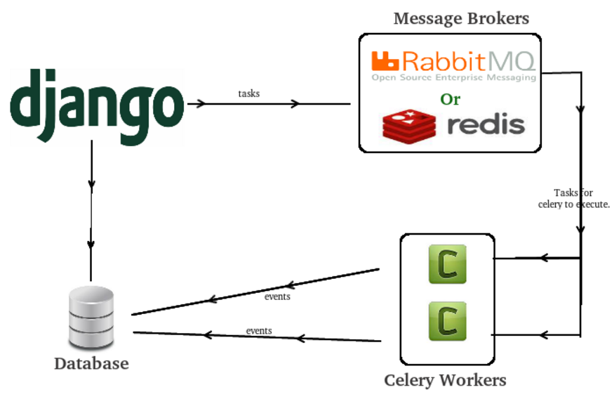

# 개념

## 샐러리란?

- 파이썬으로 작성된 비동기 작업 큐 이다.
- 작업(Task)을 메세지 브로커(Rabbit MQ, Redis 등)를 통해 전달하면 하나 이상의 워커(Worker)가 처리하는 구조이다.
- 이메일 전송, 포스팅 기능등 비동기 처리가 필요한 작업을 위임한다.

## 기본 구조

## 도움되는 포스트

[LINK](https://jonnung.dev/python/2018/12/22/celery-distributed-task-queue/)
