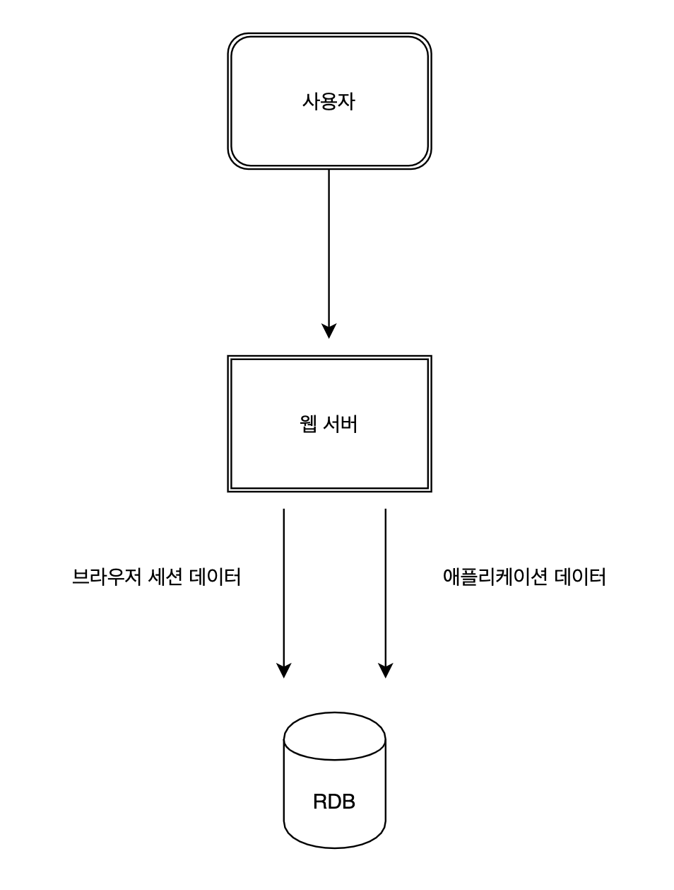
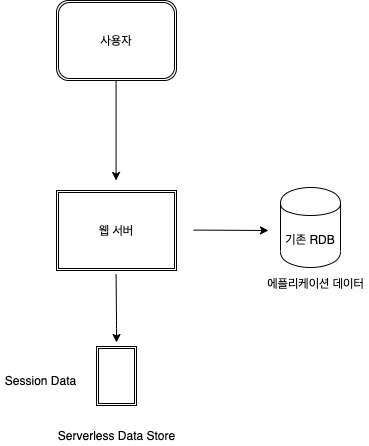

[공부 자료](https://www.youtube.com/watch?v=Ot-4lhJCrQI)

# 클라우드 네이티브 애플리케이션 설계

---

## 애플리케이션의 현대화

### 현대화 애플리케이션의 요소

1. 아키텍처 패턴
   - 모듈식 서비스로 나뉘어진다. 현대화된 애플리케이션에서 속도, 유지보수성 등이 결국 모듈식으로 나뉘어져 있기 떄문에 가능한 것이다.
   - Domain DD, Data DD 같은 형태의 접근 방법이 있는데 활용하고자 하는 데이터의 목적이나 활용에 따라서 선택할 수 있다.
2. 운영 모델
   - 관리형 서비스의 활용이 중요하다. 애플리케이션이 한 번 개발되고 나서 유지 관리되다가 필요에 따라서 능동적으로 대응할 수 있다. 이런 능동적으로 대응하는 것들이 결국에 사용자에게 피드백을 받아 확장된다.
   - 비즈니스 상황이 날이 갈수록 변화 되는데 그에 대해 대응하는 것이 현대화 애플리케이션에 중요한 요소이다.
3. 배포 방식
   - 자동화, 표준화 되어 있는 배포 방식을 가지게 된다.
   - 자동화, 표준화가 되어 있지 않다면 속도, 재사용성, 장애 격리 같은 것들이 제대로 이루어지지 않는다.
4. 관리 및 운영 방침
   - 각각의 개발팀이나 개발자들이 어떤 표준화되어 있는 플랫폼 안에서 컴포넌트화하고 서로간에 통신하는 규약에 따라 자동으로 배포하고 운영 관리하게 된다.
   - 큰 틀안에서 서비스가 배포, 유지보수가 서비스간에 영향이 가지 않도록 하는 것이다.
   - 조직의 리더들이 관리하는 것이 아니라 개발하고 운영하는 개발자들이 그 책임을 갖는 것이다.
5. 데이터 관리
   - 일반적으로 모놀리딕 애플리케이션은 한 군데에 모아놓고 관리를 했다.
   - 현대화 애플리케이션은 데이터를 목적과 서비스에 따라 다양한 형태의 자료구조와 스토리지, 데이터 베이스로 나뉘어져 관리한다.

## 운영 모델

### 컴퓨팅 발전 단계

1. 물리 서버

   - 추측을 기반으로 계획한다.
   - 온프레미스에서 수년간 사용된다.
   - 과도한 투자가 이루어져야 한다.
   - 낮은 혁신 요소

2. 가상 서버

   - 하드웨어 독립성
   - 더 빠른 프로비저닝 속도(분 / 시간)
   - 초기 투자 비용보다는 운영 비용으로 전환된다.
   - 배포 구조도 유연해진다.

3. 컨테이너

   - 플랫폼 독립성
   - 일관된 런타임 환경
   - 더 높은 자원 활용
   - 더 쉽고 빠른 배포
   - 격리 및 샌드박싱
   - 시작 속도 (초 단위로 배포)

4. 서버리스
   - 오직 비즈니스 로직에 초점을 둘 수 있음
   - 지속적인 확장
   - 내결함성 내장
   - 사용한 만큼만 지불
   - 유지 보수 x

### 게으름(생산성)의 법칙(Law of Laziness)

- 개발자는 최소한의 노력으로 작업을 완료하는 도구를 선택해야 생산성을 높일 수 있다.

### 서버리스를 사용한 웹 사이트 세션 데이터 아키텍처 개선

1. 사용자가 급속하게 증가함에 따라 많은 수의 사용자가 웹서버를 통해 RDB에 부하를 주게 된다. 브라우저의 세션 데이터에는 단순히 세션 데이터만 있는게 아니라 다양한 형태의 데이터들이 추가될 수 있다.
2. 부하가 증가함에 따라 단순히 접속만 하는 데이터들도 병목현상이 발생

1. 애플리케이션 데이터들을 기존 데이터 베이스에 넣는다.
2. 세션 데이터만 서버리스 데이터 스토어에 저장함으로써 확장성있는 구조가 된다.

## 애플리케이션 설계 접근방법

### 마이크로서비스

1. 모놀리스 애플리케이션들끼리 loosed coupled되게 분할을 한다.
2. RESP API를 통해 통신되는 구조를 만든다.
3. 각각 컴포넌트들을 도메인 드리븐이나 데이터 드리븐방식 같이 나눈다.
4. API poll로 통신하게 만든다.

### 함수형 마이크로서비스

- 함수로 정의된 표줄 빌딩 블록 서비스는 표준화 된 플랫폼으로서의 기능을 제공한다. -> 마이크로 서비스가 함수로

## 개발 방식 차이점

| 전통적 방식                                       | 급속 개발 방식                                                      |
| ------------------------------------------------- | ------------------------------------------------------------------- |
| 완전한 맞춤형 디자인                              | 빌딩 블록 조립                                                      |
| 몇 개월의 작업                                    | 업무 시간                                                           |
| 구성 요소간에 디버깅 등을 통합하여 관리(모놀리스) | 신뢰할 수 있는 표준 구성 요소가 확장되고 잘 이해되고 상호 운용 가능 |
| 너무 많은 세부 선택                               | 사용 가능한 패턴에 맞게 요구 사항을 조정해야 함                     |
| 긴 의사 결정 주기                                 | 적절한 제약은 논쟁을 줄이고 결정 속도를 높임                        |
