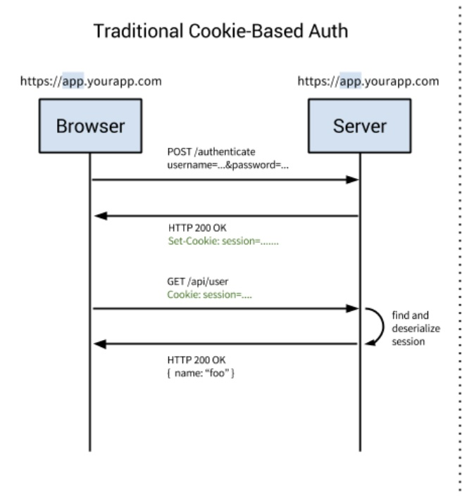
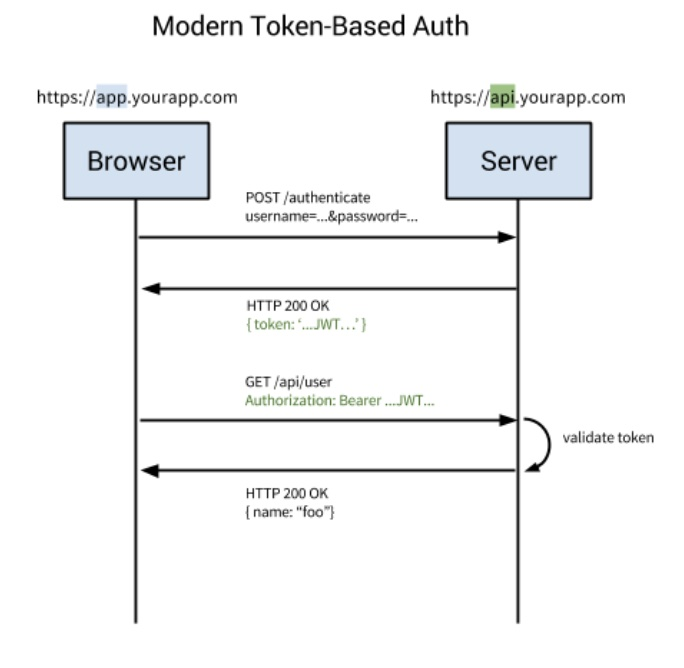

# Token Authentication

토큰 인증 시스템전에 전통적인 인증 시스템에 대하여 알아본다.

## 전통적인 인증 시스템

_출처: https://medium.com/@samueleresca/developing-token-authentication-using-asp-net-core-c3fbd7bfd7cb_

### 인증 순서

1. 사용자는 로그인 폼에 아이디/비밀번호를 입력 후 로그인 버튼을 누른다.
2. 서버는 요청이 들어오면 유저를 검증한다. 검증되었다면 세션을 생성하고 세션 정보를 요청 헤더에 포함하여 반환한다.
3. 클라이언트는 제한된 end points에 접근할 때 요청 헤더에 세션 정보를 포함하여 요청한다.
4. 세션 정보가 유효하다면 서버는 요청을 수락하고 렌더링된 html을 반환한다.

### 안드로이드나 ios같은 다른 클라이언트에도 동작할까?

전통적인 인증방식으로는 모바일 클라이언트에서도 동일하게 인증을 처리할 수 없다. 그 이유는

1. 세션과 쿠키는 모바일 애플리케이션이 이해할 수 없다. 서버에서 생성된 세션과 쿠키 정보는 모바일 애플리케이션에 공유 할 수 없다.
2. 현재 애플리케이션에서는 html이 반환되었는데, 모바일 클라이언트는 JSON 또는 XML 포맷의 응답이 필요하다.

이러한 이유들 떄문에 클라이언트 독립적인 애플리케이션이 필요하다.

### 전통적인 인증 시스템 문제점

#### 세션

사용자가 인증할 때, 서버는 사용자의 정보를 세션에 저장해야 한다. 대부분의 경우에는 메모리에 정보를 저장하는데, 로그인 중인 유저가 많아진다면 서버 램에 과부하가 생길 수 있다. 또한 데이터베이스의 성능에 무리를 줄 수 있다.

#### 확장성

세션을 사용하면 서버를 확장하는 것이 어려워진다. 서버의 확장이란, 더 많은 트래픽을 처리하기 위해 여러개의 프로세스를 추가하거나 여러대의 서버를 추가하는 것을 말한다. 세션을 사용하면 분산 시스템을 설계할 수 있지만 과장이 굉장히 복잡하다.

#### CORS(Cross-Origin Resource Sharing)

웹 애플리케이션에서 세션을 관리할 때 자주 사용되는 쿠키는 단일 도메인 및 서브 도메인에서만 작동하도록 설계되어있다. 따라서 쿠키를 여러 도메인에서 관리하는 것은 번거롭다.

## 토큰 인증 방식이란

토큰 인증 방식이란, 서버가 클라이언트에게 토큰을 발급하고 발급이후 모든 클라이언트의 요청 헤더에 토큰을 포함하여 요형하면 서버는 토큰으로 사용자 인증을 처리하고 응답하는 방식을 말한다. 전통적인 인증 방식은 세션에 유저의 정보를 저장해야 하지만, 토큰 인증 방식은 그럴 필요가 없다.

_출처: https://medium.com/@samueleresca/developing-token-authentication-using-asp-net-core-c3fbd7bfd7cb_

### 인증 순서

1. 사용자는 로그인 폼에 아이디/비밀번호를 입력 후 로그인 버튼을 누른다.
2. 서버는 요청이 들어오면 유저를 검증한다. 검증되었다면 토큰을 생성하고 토큰 정보를 응답 헤더에 포함하여 반환한다.
3. 클라이언트는 end points에 접근할 때 모든 요청 헤더에 토큰을 포함하여 요청한다.
4. 토큰이 유효하다면 사용자의 접근을 허용하고 JSON 또는 XML 포맷으로 응답한다.

토큰 기반 인증은 모던 웹서비스에서 많이 사용되고 있다. 웹서비스를 개발한다면, 토큰을 사용하여 사용자들의 인증작업을 처리하는 것이 가장 좋은 방법이다.

그 이유는 4가지 정도가 있다.

### Stateless

상태를 유지하지 않으므로 서버는 클라이언트에서 들어오는 요청만으로 처리를 한다. 이렇게 상태가 없는 경우에 클라이언트와 서버가 분리되기 떄문에 서버의 **확장성** 이 높아진다.

### 모바일 애플리케이션에 적합

안드로이드 또는 ios 모바일 애플리케이션을 개발 한다면, 안전한 API를 만들기 위해 쿠키같은 인증시스템은 이상적이지 않다. 토큰 인증 방식은 간단하게 이 번거로움을 해결할 수 있다.

### 인증 정보를 다른 애플리케이션에 전달

대표적으로 OAuth가 있다. 예로 소셜 계정을 통해 다른 웹서비스에도 로그인이 가능하게 할 수 있다.

### 보안

토큰 기반 인증 시스템으로 보안을 높일 수 있다. 단, 이 시스템을 사용한다고 무조건 적으로 안전하다는 것은 아니다.

##

## References

_https://behonestar.tistory.com/37_
_https://velopert.com/2350_
